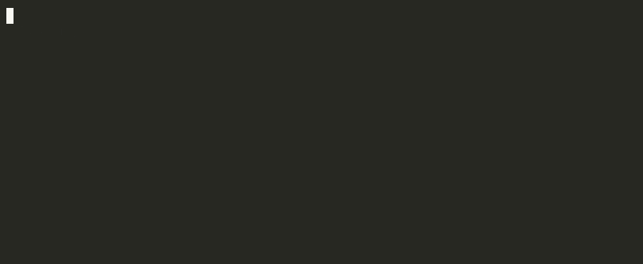

```
███╗   ██╗██╗   ██╗███╗   ███╗ ██████╗ ██████╗
████╗  ██║╚██╗ ██╔╝████╗ ████║██╔═══██╗██╔══██╗
██╔██╗ ██║ ╚████╔╝ ██╔████╔██║██║   ██║██████╔╝
██║╚██╗██║  ╚██╔╝  ██║╚██╔╝██║██║   ██║██╔══██╗
██║ ╚████║   ██║   ██║ ╚═╝ ██║╚██████╔╝██║  ██║
╚═╝  ╚═══╝   ╚═╝   ╚═╝     ╚═╝ ╚═════╝ ╚═╝  ╚═╝
```

# Nymor

<p align="center">
  <strong>One command to sync your AI agent rules everywhere.</strong>
</p>

<p align="center">
  <a href="https://www.npmjs.com/package/nymor"></a>
  <a href="https://github.com/mustafakmelli/nymor/blob/main/LICENSE"></a>
  
  
</p>

<p align="center">
  
</p>

---

## The problem

Every AI agent reads rules from a different file.

```
Claude Code     →  CLAUDE.md
Cursor          →  .cursor/rules/*.mdc
GitHub Copilot  →  .github/instructions/*.md
Kiro            →  .kiro/steering/*.md
Gemini CLI      →  GEMINI.md
Windsurf        →  .windsurf/rules/*.md
```

If your team uses more than one agent, you maintain the same rules in multiple places. They drift. You forget to update one. A new teammate sets up a different tool and gets different rules.

**Nymor fixes that.** Write your rules once in `.nymor/skills/`. One command syncs them to every agent your team uses.

---

## Quick start

```sh
npx nymor sync
```

That's it. Nymor auto-detects which agents are configured in your repo, imports any existing rules from `.cursorrules` or Cursor rule files, and compiles native output for each agent — all in one shot.

```
  Agents:   Claude, Cursor, Copilot
  Import:   Imported 2 existing rules from .cursorrules
  Skills:   2 compiled → 3 agent surfaces

  ✓  Claude Code          CLAUDE.md
  ✓  Cursor               .cursor/rules/
  ✓  GitHub Copilot       .github/instructions/

  Run "nymor list" to see all active skills.
```

No config file to write. No interactive prompts. No manual steps.

---

## Teaching your agents new rules

Inside any AI agent chat (Claude, Cursor, Copilot, Kiro…):

```
You:    "We never use API routes here. Always use Server Actions."
Agent:  "Got it — this looks like a durable repo rule.
         Want me to capture it with /nymor-learn?"
You:    /nymor-learn "Use Server Actions for mutations, not API routes"
```

The agent writes the skill to `.nymor/skills/<id>/SKILL.md`, updates `nymor.json`, and runs `nymor sync`. Your rule is now compiled into every agent surface — committed to the repo, visible in Git history, reviewable in a PR.

Next chat. Same rule. Already known.

---

## Supported agents

| Agent | Output |
| --- | --- |
| Claude Code | `.claude/skills/`, `CLAUDE.md` |
| Cursor | `.cursor/rules/nymor-*.mdc` |
| GitHub Copilot | `.github/instructions/nymor-*.instructions.md` |
| Kiro | `.kiro/steering/nymor-*.md` |
| Gemini CLI | `GEMINI.md` |
| Windsurf | `.windsurf/rules/nymor.md` |
| Goose | `.goose/skills/` |
| OpenCode | `.opencode/skill/` |
| Codex, Aider, Warp, Devin, Junie, Zed | `AGENTS.md` |

---

## How it works

**1. Your rules live in `.nymor/skills/` as plain Markdown**

```
.nymor/
  skills/
    server-actions-only/
      SKILL.md
    commit-conventions/
      SKILL.md
```

**2. `nymor sync` compiles them to each agent's native format**

Each agent gets its own file format (`.mdc` for Cursor, frontmatter-wrapped `.md` for Copilot, etc.). Nymor handles the translation automatically.

**3. Git owns the history. Your team reviews changes like any other code.**

Skills are plain text files. Every `/nymor-learn` is a commit. PRs show exactly what rules were added or changed.

---

## Skill format

Skills are plain Markdown with a YAML frontmatter header:

```md
---
name: Server Actions Only
description: Use this when changing application mutations.
globs:
  - "app/**/*.ts"
  - "app/**/*.tsx"
alwaysApply: false
---

# Skill: Server Actions Only

## Rule

Use Server Actions for mutations. Do not create API routes for app mutations.

## Why

Keeps mutation logic close to the UI and preserves the repo's auth pattern.

## Example

// WRONG
export async function POST(req: Request) { ... } // app/api/users/route.ts

// CORRECT
'use server'
export async function updateUser(data: UserData) { ... } // app/users/actions.ts
```

---

## Commands

```sh
nymor sync      # Sync skills to all agent surfaces (main command)
nymor list      # List active repo skills
nymor status    # Show sync state and stale outputs
nymor doctor    # Check skills for common issues
nymor watch     # Watch skills and auto-sync on changes
```

**Options for `sync`:**

```sh
nymor sync --dry-run              # Show what would change without writing
nymor sync --agents claude cursor # Override auto-detected agents
nymor sync --force                # Re-import existing rules
```

---

## What Nymor does not do

- **No central catalog.** Skills are yours. They live in your repo. There is nothing to install from the internet.
- **No LLM calls.** Nymor syncs and validates. The agent writes the skill. You review it.
- **No magic.** Every output is a plain file you can read, edit, delete, and commit.

---

## `nymor.json`

```json
{
  "version": "1",
  "agents": ["claude", "cursor", "copilot", "kiro", "agents-md"],
  "local": ["server-actions-only", "commit-conventions"]
}
```

---

## Generated files

```
.nymor/
  skills/
    server-actions-only/
      SKILL.md
  index.md
  index.json
nymor.json

CLAUDE.md                                           ← Claude bootstrap
.claude/commands/nymor-learn.md                     ← Claude slash command
.claude/skills/<id>/SKILL.md                        ← Claude native skills

.cursor/rules/nymor.mdc                             ← Cursor bootstrap
.cursor/rules/nymor-<id>.mdc                        ← Cursor per-skill
.cursor/commands/nymor-learn.md                     ← Cursor slash command

.github/instructions/nymor-bootstrap.instructions.md
.github/instructions/nymor-<id>.instructions.md
.github/prompts/nymor-learn.prompt.md               ← Copilot slash command

.kiro/steering/nymor.md
.kiro/steering/nymor-<id>.md

AGENTS.md                                           ← Codex, Aider, Warp, etc.
GEMINI.md
.windsurf/rules/nymor.md
.goose/skills/<id>/SKILL.md
.opencode/skill/<id>/SKILL.md
```

---

## MCP server

Nymor ships with an MCP server that agents can query to retrieve and search skills:

```sh
nymor mcp
```

Add it to your MCP config and agents can call `get_skills` and `search_skills` tools to find the right rule for any file or query.

---

## Contributing

```sh
git clone https://github.com/mustafakmelli/nymor.git
cd nymor
npm install
npm run build
npm test
```

See [CONTRIBUTING.md](CONTRIBUTING.md) for how to add a new agent target or open a PR.

---

## License

MIT
